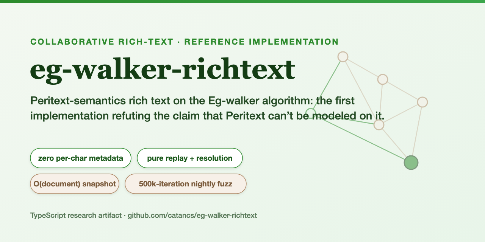
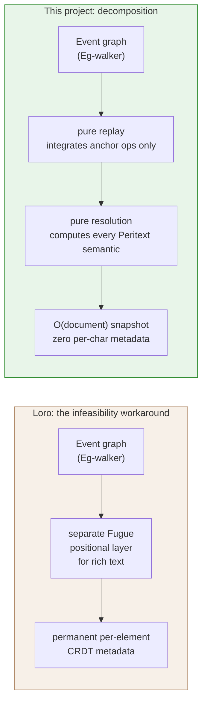
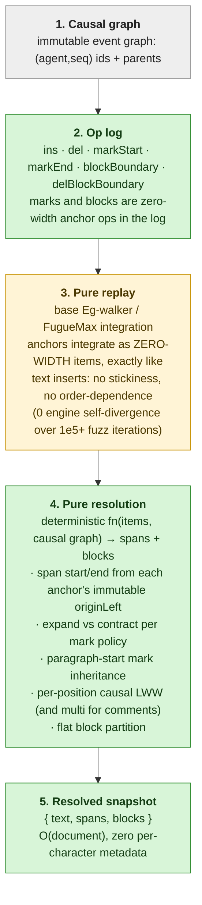

# eg-walker-richtext

<p align="center">
  
</p>

<p align="center">
  <a href="https://github.com/catancs/eg-walker-richtext/actions/workflows/ci.yml"></a>
  <a href="LICENSE"></a>
  
  <a href="https://arxiv.org/abs/2409.14252"></a>
  
  
</p>

**Peritext-semantics rich text on the Eg-walker collaborative-editing algorithm: a reference implementation in TypeScript.** June 2026.

This is, as far as I am aware, the first implementation of inline rich-text marks (bold, italic, underline, link, comment, color, font) plus flat paragraph blocks on the **Eg-walker** event-graph replay algorithm. I built it to refute a specific published claim, that Peritext semantics *cannot* be modeled on Eg-walker, by building the thing and shipping the evidence. It is a research and reference artifact, not a production library (see [Status](#6-status--whats-deferred)).

---

## 1. Why I built this

**Eg-walker** (Gentle & Kleppmann, EuroSys 2025, [arXiv:2409.14252](https://arxiv.org/abs/2409.14252)) is the leanest way I know to do collaborative *plain* text. It keeps the original edits as an immutable event graph, carries **zero per-character metadata** at rest, and only rebuilds a throwaway CRDT while it merges. The paper left **rich text** as future work, and as of June 2026 nobody had shipped it.

The closest anyone got was Loro, and they concluded it **couldn't** be done. The argument: Peritext's formatting is inherently *order-dependent*, but Eg-walker's replay has to be *order-independent* (every op must mean the same thing no matter the document state), so the two can't mix. They put rich text on a separate Fugue layer instead, paying permanent per-element metadata for every formatted character. I didn't buy the impossibility, so I set out to build the counterexample.

**The whole idea is decomposition.** Keep replay dumb: it only ever drops in zero-width *anchor* ops and never decides what anything means. Push **all** of Peritext's order-dependent logic into one **pure resolution function** that runs when you read the document. Replay stays order-independent because it never decides what a span covers; resolution is *allowed* to be order-dependent because it's a deterministic function of the finished causal graph, computed identically on every replica. The rest of this README is the evidence that it holds.



> To be fair to Loro: their reading of Eg-walker's replay contract is reasonable. The point here isn't that they were wrong to be careful, it's that the contract can be *satisfied* (by moving the order-dependent work out of replay) instead of declared impossible. A contrast with their engineering, not a knock on it.

### Where this sits: the landscape in one table

*Contrast, not ranking. The only axis this project leads on is metadata **shape**; the others are mature production systems (or, for Google Docs, a different algorithm lineage entirely). This is a v1 research artifact and does not claim to beat them on speed or encoded size, it does not.*

| Axis | **eg-walker-richtext** (this project) | **Loro** (crdt-richtext) | **Yjs** (Y.Text) | **Automerge** (rich text) | **Google Docs / OT** |
| --- | --- | --- | --- | --- | --- |
| **Algorithm family** | Event-graph replay CRDT (Eg-walker) | Sequence CRDT (Fugue) + Peritext spans | Sequence CRDT (YATA) | Sequence CRDT (RGA) + Peritext marks | Operational Transformation (Jupiter), not a CRDT |
| **Rich-text model** | Peritext-style spans + blocks via a pure resolution function | Peritext spans over a Fugue list | Inline formatting items / attributes in the sequence | Peritext-style marks stored outside the text | Server-side OT document model |
| **Per-element CRDT metadata in steady state** | Zero in the resolved snapshot <sup>1</sup> | Per-element metadata in its positional layer <sup>2</sup> | Permanent per-item metadata (item IDs, origins) <sup>3</sup> | Permanent per-character metadata (RGA element IDs) <sup>4</sup> | N/A, no CRDT metadata (OT) <sup>5</sup> |
| **Steady-state persistent form** | Resolved `{text, spans, blocks}` snapshot, O(document), plus an append-only oplog <sup>6</sup> | History/structure with per-element IDs <sup>2</sup> | Item-based document structure (full history) <sup>3</sup> | RGA structure + marks (full history) <sup>4</sup> | Server-stored document + op log <sup>5</sup> |
| **Maturity** | Research / reference artifact (v1, unoptimized) <sup>7</sup> | Production library | Production library | Production library | Shipped product |
| **Central server required?** | No (peer-to-peer capable) | No (peer-to-peer capable) | No (peer-to-peer capable) | No (peer-to-peer capable) | Effectively yes (server-coordinated) <sup>5</sup> |

<details>
<summary><b>Sources and per-cell caveats</b></summary>

1. **This repo:** zero per-char metadata is a metadata-*shape* property, not a benchmark win.
2. **Loro:** Fugue list elements carry CRDT identity; annotations live in a separate `RangeMap`. Loro is heavily compacted, so this is model-level, not a footprint claim. [blog](https://loro.dev/blog/loro-richtext), [repo](https://github.com/loro-dev/crdt-richtext).
3. **Yjs:** YATA linked-list `Item`s with IDs + origin refs; formatting inline. [INTERNALS](https://github.com/yjs/yjs/blob/main/INTERNALS.md).
4. **Automerge:** Peritext over an RGA sequence (per-element IDs); marks stored outside the text (since 2.2). [blog](https://automerge.org/blog/rich-text/).
5. **Google Docs / OT:** Jupiter OT, server-coordinated; not a CRDT, and a different lineage this project neither descends from nor improves on. "Effectively yes" reflects the deployed model, not OT theory. [Jupiter](https://arxiv.org/pdf/1708.04754), [OT vs CRDT](https://arxiv.org/pdf/1905.01517).
6. **This repo:** durable form is an append-only oplog (JSON, v1); the snapshot is the read form.
7. **This repo:** unoptimized TS reference; not claimed to beat Yjs/Automerge on speed or size (see §5, §6).

</details>

---

## 2. What it is

A document is edited through an append-only **op log** carrying six op kinds: `ins`, `del`, `markStart`, `markEnd`, `blockBoundary`, and `delBlockBoundary` (a mark is an open `markStart` plus a matching `markEnd` referencing it by raw `(agent, seq)`; `delBlockBoundary` tombstones a boundary by identity to merge two paragraphs). Materializing the log yields a **resolved snapshot**:

```ts
interface RichSnapshot {
  text:    string[]                            // the visible characters
  spans:   { start, end, markType, value }[]   // resolved inline marks
  blocks:  { start, end, blockType }[]         // flat paragraph partition
  version: [agent, seq][]
}
```

The snapshot carries **zero per-character metadata**; it is O(document), not O(history). The CRDT machinery exists only in the append-only log and in a transient structure built during a checkout.

---

## 3. How it works

This describes the **final** architecture as implemented in `src/`. (The original design placed mark stickiness in replay via a "sticky-skip" during anchor placement. I **removed** it: the differential fuzzer proved it broke convergence, because a side-based cursor move reads the replica-dependent transient arrangement of concurrent not-yet-inserted anchors. Placement is now 100% pure base FugueMax, and *every* Peritext semantic lives in resolution. See `src/index.ts` `apply1`, which has no sticky-skip, and `src/resolve.ts`.)



Legend: **grey** = vendored from eg-walker-reference, unchanged. **amber** = vendored base integration, extended only to route the new anchor ops through it as zero-width items. **green** = new in this project.

The key move: **replay places anchors but never interprets them.** A `markStart` or `markEnd` is just a zero-width FugueMax item; its *resolved* position is recomputed at resolution from its immutable `originLeft` (the character to its left at integration time, a pure function of its prepare version) plus the causal graph, **not** from where FugueMax happened to drop the anchor item among concurrent boundary text. That is what makes resolution order-independent across replicas while remaining order-*aware* of the marks themselves. Expand and contract, paragraph-start inheritance, LWW conflict resolution, and the flat-block partition are all computed there as pure functions.

### Usage

```ts
// Reference artifact: import from the source modules (no npm package / exports map).
import {
  createOpLog, localInsert, localMark, localSplitBlock, localMergeBlock, mergeOplogInto,
} from './src/index.js'
import { checkoutRich } from './src/resolve.js'

// Replica A types a sentence, bolds a word, and starts a new paragraph.
const a = createOpLog<string>()
localInsert(a, 'alice', 0, ...'Hello brave world')
localMark(a, 'alice', 6, 11, 'bold')      // bold "brave"
localSplitBlock(a, 'alice', 17)           // paragraph break

// Replica B concurrently writes its own text and links part of it.
const b = createOpLog<string>()
localInsert(b, 'bob', 0, ...'see docs')
localMark(b, 'bob', 4, 8, 'link', 'https://example.com')

// Merge both ways; both replicas converge.
mergeOplogInto(a, b)
mergeOplogInto(b, a)

const snap = checkoutRich(a)
console.log(snap.text.join(''))   // "Hello brave worldsee docs"
console.log(snap.spans)
//  [ { start: 6,  end: 11, markType: 'bold', value: true },
//    { start: 21, end: 25, markType: 'link', value: 'https://example.com' } ]
console.log(snap.blocks)
//  [ { start: 0,  end: 17, blockType: 'paragraph' },
//    { start: 17, end: 25, blockType: 'paragraph' } ]

// Alice merges the two paragraphs back into one by deleting the boundary
// (a backspace at the paragraph start). Merging is a v1 capability: the
// delBlockBoundary op tombstones the boundary by identity, resolution drops
// it, and the following text rejoins the preceding block.
localMergeBlock(a, 'alice', 17)
mergeOplogInto(b, a)                       // both replicas still converge

console.log(checkoutRich(a).blocks)
//  [ { start: 0, end: 25, blockType: 'paragraph' } ]   // one paragraph again
//  (text and spans are unchanged; only the block partition merges)
```

(I run and verify this exact example during development; the output above is its real output.)

---

## 4. The evidence

Full, reproducible evidence, with every claim mapped to a runnable result, lives in **[EVIDENCE.md](EVIDENCE.md)** (generated by `scripts/gen-evidence.ts`, which exits non-zero if any test or the fuzzer fails). Summary:

### (a) Claims to evidence

| Claim | Statement (abridged) | Evidence |
| --- | --- | --- |
| **C1 Feasibility** | Peritext-semantics inline formatting runs on an event-graph replay engine (anchors inside replay, pure resolution outside). | the engine + `test/adversarial.test.ts`, `test/anchors.test.ts` |
| **C2 Intent preservation** | Passes Peritext Examples 1 to 8 and failure cases P1 to P4, the tombstone-capture bug (peritext#32), and Yjs's orphaned-marker bug (yjs#197). | citation-named tests + the independent oracle |
| **C3 Memory shape** | Persistent state is O(document): snapshot with zero per-char metadata; anchors live only in the log + transient replay. | `bench/bench.ts` to `bench/results.json` |
| **C4 Convergence** | All replicas converge for arbitrary concurrent histories. | differential fuzzer vs an independent oracle |
| **C5 Flat-block semantics** | Concurrent paragraph split/merge plus text edits have specified, tested merge behavior. | `test/blocks.test.ts`, block-convergence regression |

### (b) "Claims = test names": the citation-named adversarial suite

Each published Peritext or Yjs failure case the design must guard against is an **executable, citation-named test**: `peritext_P1_concurrent_overlap_bold`, `peritext_P2_toggle_counting_dog`, `peritext_P4_unbounded_bleed`, `peritext_example1_concurrent_insert_inside_span`, `peritext_example4_color_lww`, `peritext_table1_overlapping_comments`, `peritext_issue32_tombstone_capture`, `yjs_197_orphaned_markers`. Each is asserted twice: once against the engine, once against the independent oracle.

### (c) Differential fuzzing vs an independent oracle

`test/rich-fuzzer.ts` drives replica pairs through random local edits and pairwise and full-mesh merges, comparing the engine against a **completely independent** reference: `SimpleRichDoc`, a different text CRDT with a Peritext-style side table of marks (it shares no code with the engine). Latest run:

- **Engine self-converged on 100% of iterations** (text, spans, and blocks) across 28+ seed bases and over 1e5 total iterations.
- **0 unclassified mark-resolution divergences.** Wherever the engine and oracle agreed on the full item order, mark and block resolution matched **exactly**.
- The only carve-out is a precisely-characterized **text-CRDT ordering variance** of the side-table oracle (concurrent-tombstone order or equal-letter swap). Each instance is logged, and **0** of them ever moved a resolved span or block. This is an honest limitation of the *oracle comparison*, not a mark bug.

Reproduce:

```sh
npm run evidence                          # build + suite + fuzz + bench, regenerates EVIDENCE.md
npm test                                  # 56 TAP points (55 pass, 1 expected slow-skip)
FUZZ_ITERS=10000 npm run fuzz:rich        # 10k-iteration differential fuzz
```

---

## 5. Benchmarks (honest framing)

Numbers in `bench/results.json`; the honesty framing is verbatim from `bench/bench.ts`. **Read this before reading any number:**

- My engine is a **deliberately unoptimized TypeScript reference**: no run-length encoding, every op replayed in full on every checkout, naive causal traversal, and **no binary codec** (the durable artifact is `JSON.stringify(oplog)`).
- **It is slower than Yjs and Automerge**, and my oplog-as-JSON is **larger** than their purpose-built binary codecs. This is expected and is **not** the claim; it measures a readable reference against years of Rust and WASM production engineering, not a property of the model. **I do not claim to beat them on speed or encoded size; it does not.**
- **The architectural point is memory *shape* (claim C3):** the persistent *read* form is an O(document) resolved snapshot `{text, spans, blocks}` carrying **zero** per-character CRDT metadata. On the bundled ~21k-character / 171-mark trace, that resolved snapshot is ~33 KB against the ~1 MB full-history oplog, a point-in-time read form that is not comparable to the libraries' full-history binary encodings.

This is what the model *costs*, measured honestly. Production optimization (RLE, a B-tree document index, a binary codec, lazy traversal) is future work.

---

## 6. Status & what's deferred

**This is a v1 reference implementation and research artifact. It is not production-ready.** Honesty about limits is a feature here.

**Documented v1 limitations:**
- The differential oracle has a carved-out **tombstone-order and equal-letter-swap variance** (above): characterized, logged, never a mark or block move.
- The LWW per-position fold is **order-dependent in principle** for 3+ concurrent same-position spans; it is made replica-independent by folding in a canonical, replica-independent order (resolved `start`, `end`, then raw `(agent, seq)`). This is documented in `src/resolve.ts` as load-bearing for any port or oracle.

**Deferred to future work (design §9):**
- Nested blocks (only flat paragraph blocks in v1).
- Formal verification of the resolution function.
- An optimized or Rust port (RLE, B-tree index, binary codec, lazy traversal).
- A network sync protocol.
- Cursor and presence.
- History pruning and compaction.

---

## 7. Relation to prior work & attribution

- **eg-walker-reference**: the base plain-text engine (`src/causal-graph.ts`, the base of `src/index.ts`, `test/upstream/*`, `testdata/*`) is **vendored from [josephg/eg-walker-reference](https://github.com/josephg/eg-walker-reference)** by Joseph Gentle, **BSD-2-Clause**. `src/index.ts` is extended here; all other vendored files are unchanged except import paths. See [ATTRIBUTION.md](ATTRIBUTION.md) and [LICENSE.upstream](LICENSE.upstream).
- **Eg-walker**: Gentle & Kleppmann, EuroSys 2025, [arXiv:2409.14252](https://arxiv.org/abs/2409.14252).
- **Peritext**: Litt, Lim, Kleppmann & van Hardenberg, *Peritext: A CRDT for Collaborative Rich Text Editing*, Ink & Switch / CSCW 2022. The rich-text semantics here follow Peritext.
- **Fugue / FugueMax**: Weidner & Kleppmann, [arXiv:2305.00583](https://arxiv.org/abs/2305.00583); the maximal-non-interleaving sequence CRDT used for placement (equivalent here to YjsMod / Sync9).
- **Loro `crdt-richtext`**: the contrast case and the source of the refuted "Peritext cannot be modeled on Eg-walker" claim.
- **Yjs**: `yjs#197` (orphaned markers) is one of the guarded-against failure cases.

My own code is **MIT** (see [LICENSE](LICENSE)), upstream-compatible; vendored BSD-2-Clause code is attributed as above.
